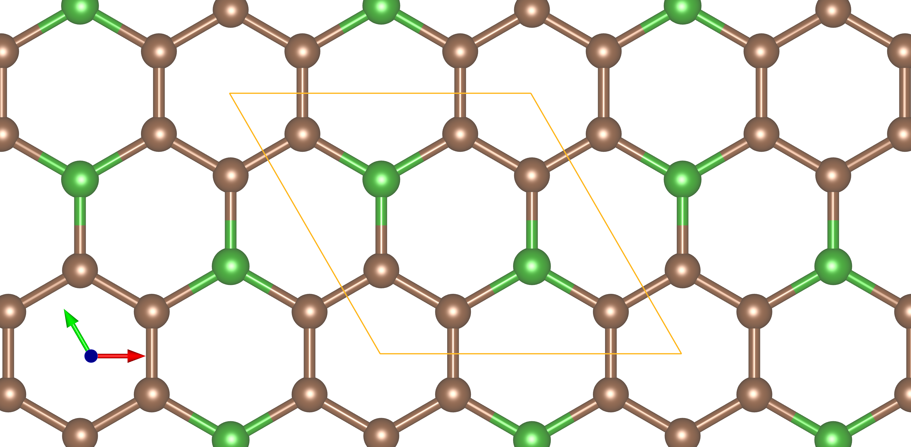
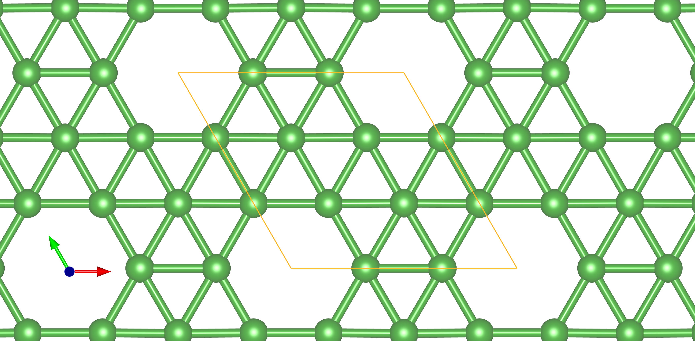
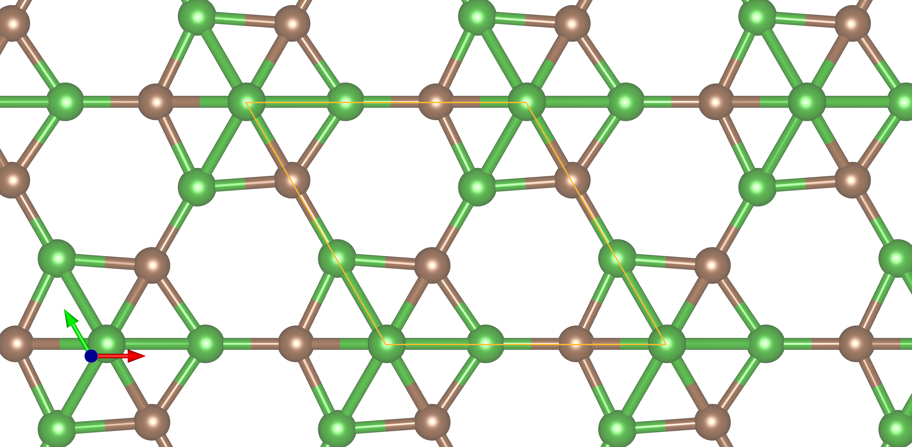
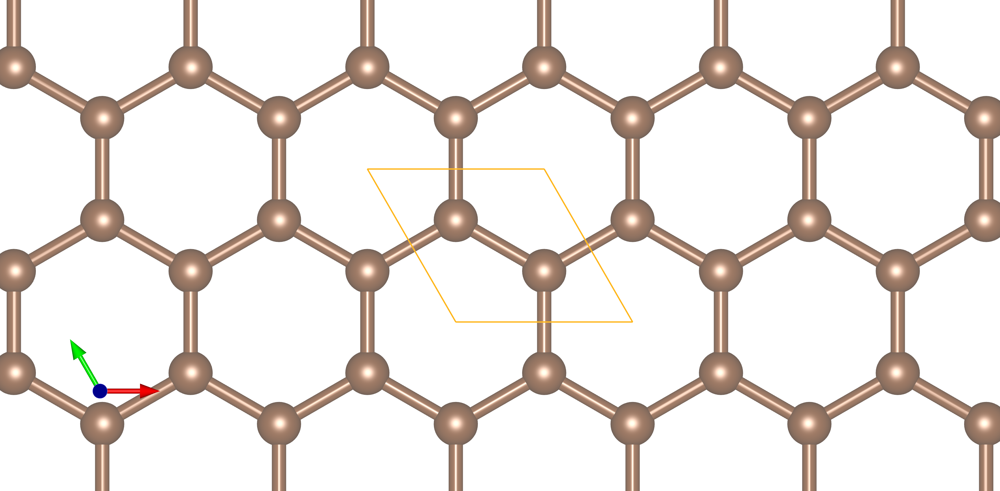
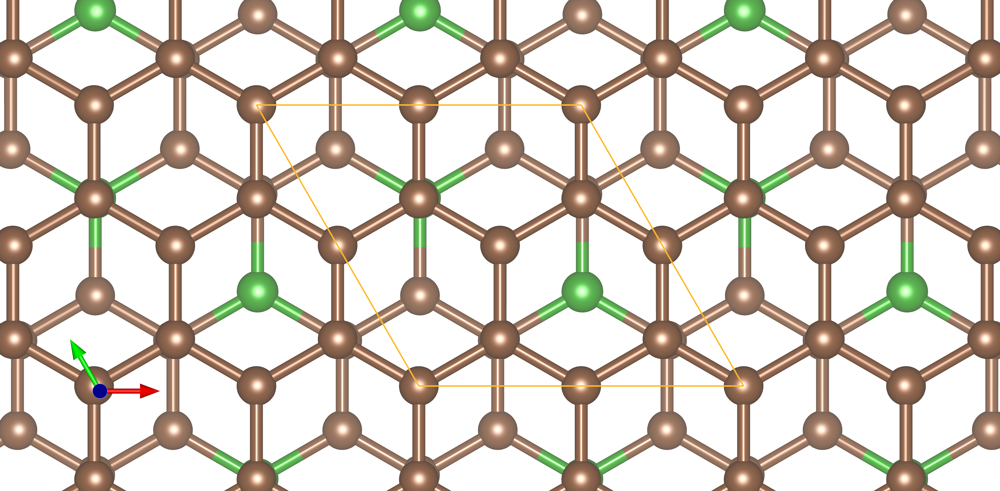
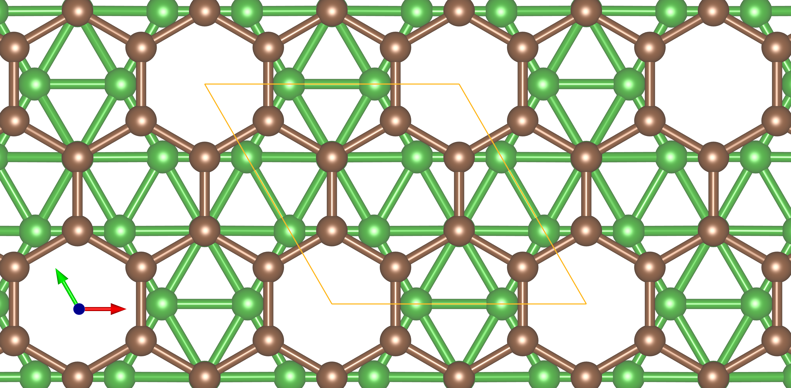
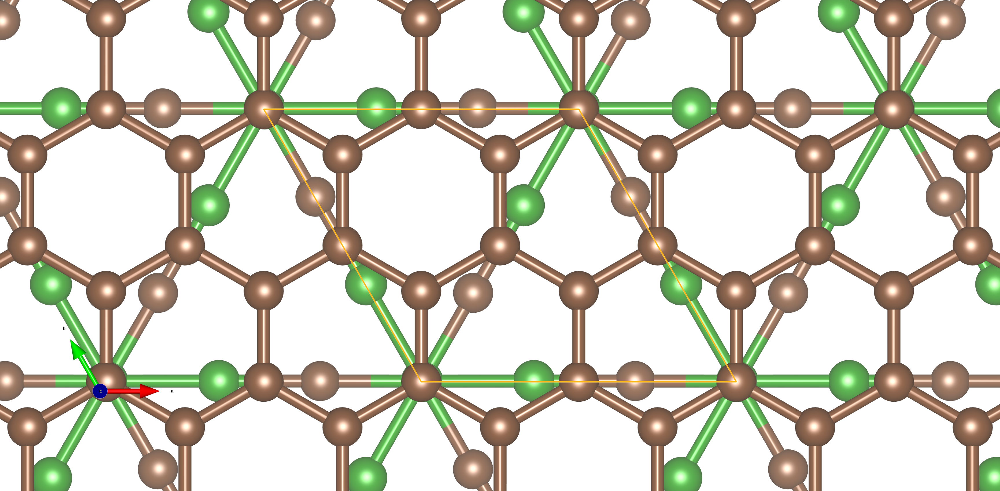
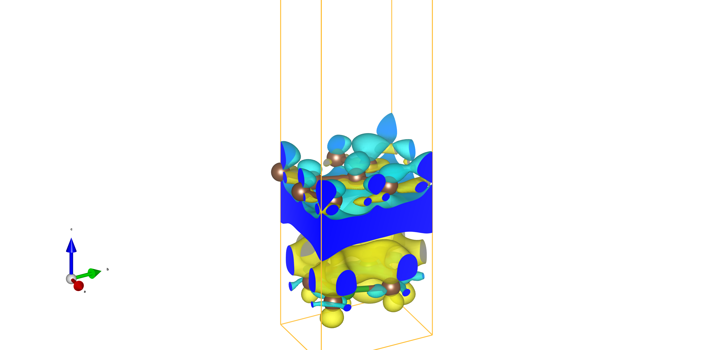
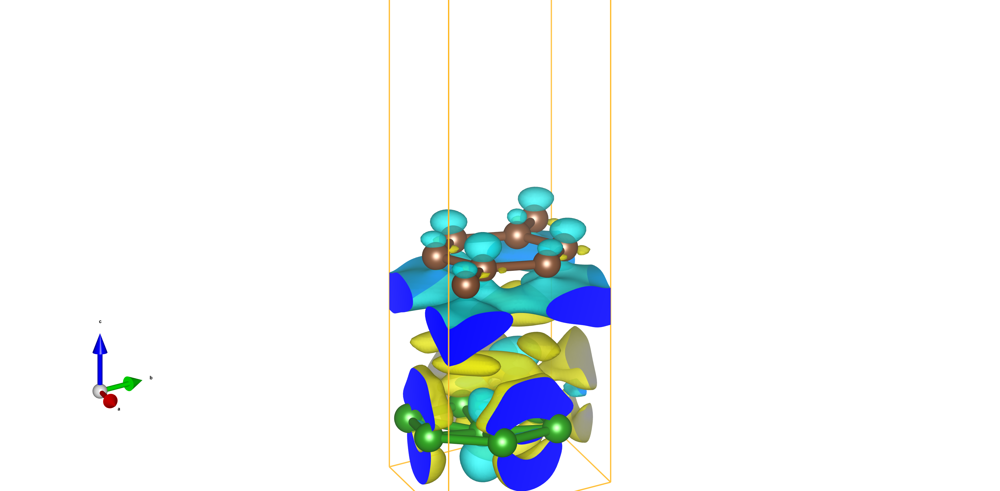
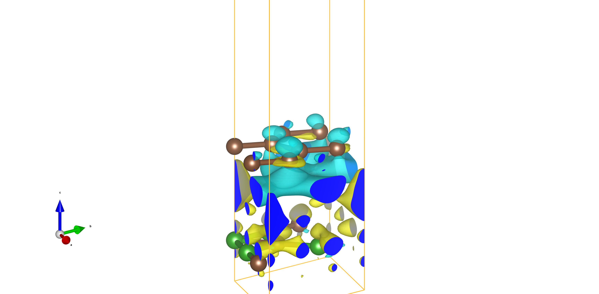

<!-- markdownlint-disable MD024 MD029 MD041 -->

<!-- _backgroundImage: URL("background.png")-->

&nbsp;

&nbsp;

&nbsp;

# Bilayer: Graphene - BC

## BC3, Borophene, B4C3

&nbsp;

Lu Niu

---

<!-- _backgroundImage: URL("background.png")-->

# Super Cells: Single layer

* BC3

* Borophene

---

<!-- _backgroundImage: URL("background.png")-->

# Super Cells: Single layer

* B4C3

* Graphene

---

<!-- _backgroundImage: URL("background.png")-->

# Super Cells: Biolayer

* Graphene - BC3: Hollow

* Graphene - Borophene: Top

---

<!-- _backgroundImage: URL("background.png")-->

# Super Cells: Biolayer

* Graphene - BC3: Hollow

* Graphene - Borophene: Top

---

<!-- _backgroundImage: URL("background.png")-->

# Super Cells: Biolayer

* Graphene - B4C3

---

<!-- _backgroundImage: URL("background.png")-->

# Super Cells: Biolayer

* Graphene - B4C3

---

<!-- _backgroundImage: URL("background.png")-->

# Charge_Density_Difference

* Graphene - B4C3

---

<!-- _backgroundImage: URL("background.png")-->

# Charge_Density_Difference

* Graphene - Borophene

---

<!-- _backgroundImage: URL("background.png")-->

# Charge_Density_Difference

* Graphene - B4C3

---